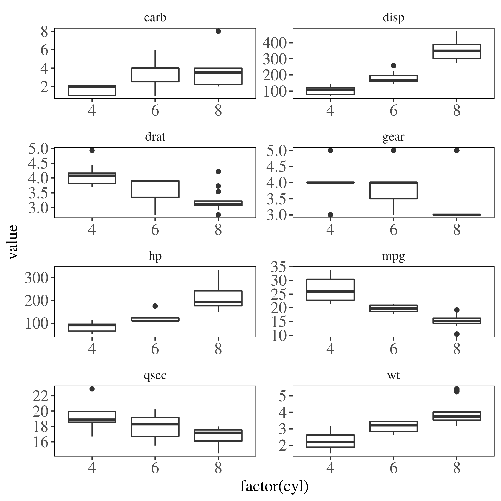

# Examples
Here are some examples

## R code
Load some library

```{r message=FALSE, warning=FALSE}
library(tidyverse)
library(knitr)
library(kableExtra)
library(ggthemes)
theme_set(theme_tufte() + 
            theme(panel.border = element_rect('black', fill = NA)))
```

Load some data and create some table which can be seen in table \@ref(tab:table1)

```{r}
mtcars %>%
  filter(row_number() <= 10) %>%
  kable(booktabs = T, 'latex',
        caption = "(\\#tab:table1) Some table") %>%
  kable_styling(full_width = F, 
                bootstrap_options = 'striped',
                latex_options = 'hold_position')
```

## Figures
Create some simple plot which can be seen in figure \ref{fig:figure1}.

```{r figure1, fig.cap = "Blablabla"}

```

### Discussion
This is some subsection where we discuss this and that. Function in equation \@ref(eq:sineq)

\begin{equation}
(\#eq:sineq)
f(x) = \sin(x)
\end{equation}
